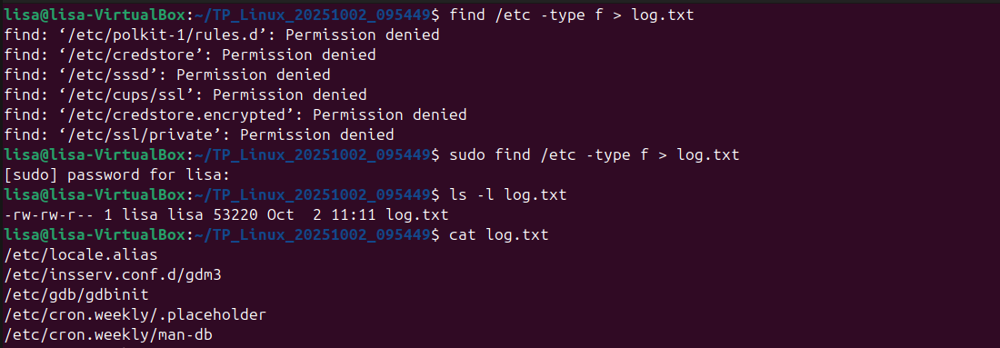
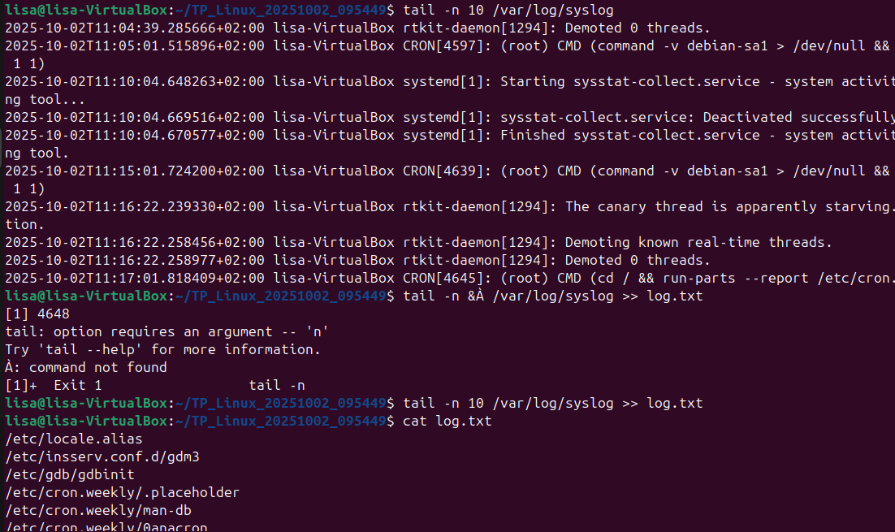
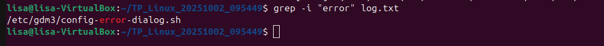

# Exercice débutant 2 :

- sudo find /etc -type f > log.txt 
Cette commande permet de lister tous les fichiers du répertoire /etc puis enregistre cette liste dans le fichier log.txt. 

- ls -l log.txt 
Cette commande permet de vérifier que le dosser à bien été crée.  

- cat log.txt 
Cette commande permet de lire le contenu du fichier log.txt.   

- tail -n 10 /var/log/syslog 
Cette commande permet d'afficher les 10 dernières lignes du fichier syslog. 

- tail -n 10 /var/log/syslog >> log.txt 
Cette commmande permet de déplacer les 10 dernières lignes du fichier syslog vers le fichier log.txt. 

- cat log.txt 
Cette commande permet d'afficher le contenu du fichier log.txt. Cela me permet de vérifier que ma dernière commande à bien été effectuée. 

- grep -i "error" log.txt 
Cette commande permet de chercher le mot "error" dans le fichier log.txt. Le "-i" permet de ne pas faire de distinction entre majuscules et minuscules. 

