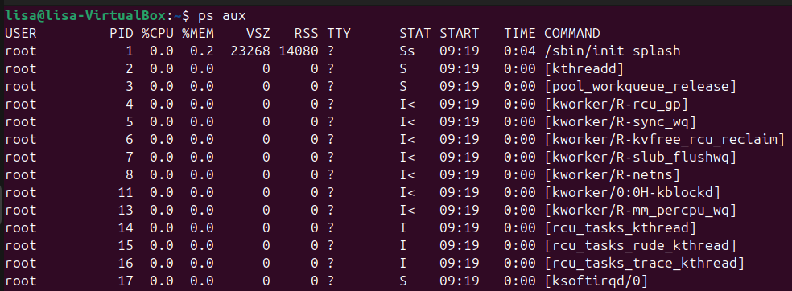
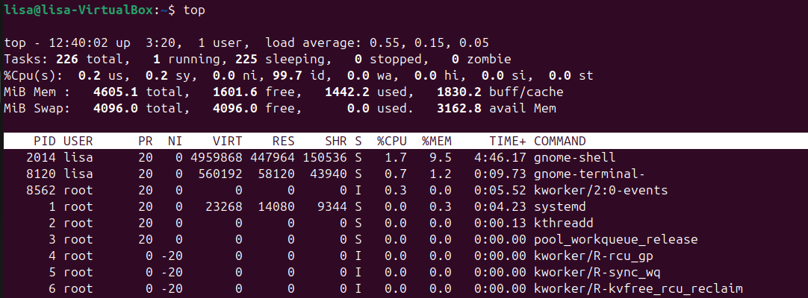
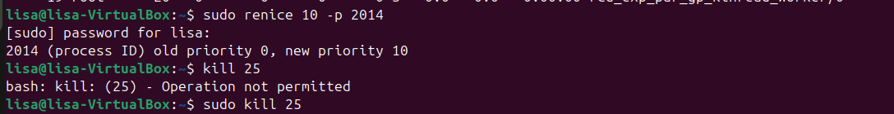

# Exercice intermédiaire 4 :

- ps aux 
Cette commande affiche tous les processus en cours. 

- top + m
Cette commande affiche en temps réel les processus et leur consommation (CPU,RAM), puis trie par consommation décroissante.(Ctrl+c pour arrêter). 

- sudo renice 10 -p 2014
Cette commande permet de modifier la priorité du processus 2014. La valeur "10" permet de diminuer la priorité. 

- sudo kill (25) 
Cette commande permet de terminer un processus, étant le PID du processus. 

