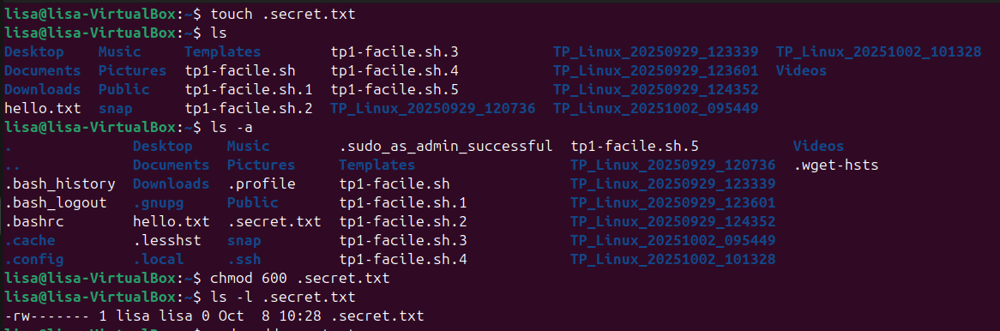

 # Exercice débutant 3 :

 - touch .secret.txt 
 Cette commande permet de créer un fichier .txt secret. C'est à dire invisible pour la commande ls. 

- ls ET ls -a 
ls affiche une liste des noms de tous les fichiers du répertoire, ls -a tous les fichiers + les fichiers cachés. 

 - chmod 600 .secret.txt 
 Cette commande permet de changer les permissions du fichier .secret.txt. 6 indique que le propriétaire peux lire et modifier le fichier, 00 que le groupe et les autres ne peuvent ni le lire ni le modifier. 

 - ls -l .secret.txt 
Cette commande permet de vérifier que les permissions ont bien été modifié. 

# Pour aller plus loin

On crée un nouvel utilisateur pour vérifier qu'il ne peux pas lire ni modifier le fichier.
