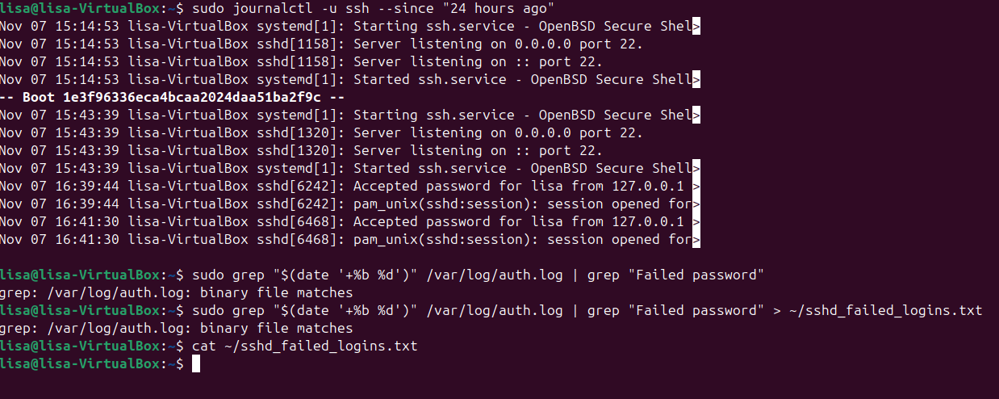

# Exercice intermédiaire 3

1. Affiche les logs du service ssh sur les 24 dernières heures.

Voici la commande:
```
sudo journalctl --since "24 hours ago" -u sshd -u ssh --no-pager
```

2. Filtre les logs pour avoir que les connexions ratées

Voici la commande: 
```
sudo grep "$(date '+%b %d')" /var/log/auth.log | grep "Failed password"

```

3. Sauvegarder dans un fichier

Voici la commande:
```
sudo grep "$(date '+%b %d')" /var/log/auth.log | grep "Failed password" > ~/sshd_failed_logins.txt
```




