# TP 1

## 1. Installation et configuration d’un serveur we

### a. Installer Apache, lancer le et vérifier son statut.
Je fais les commandes pour installer Apache, le lancer et verifier son statut (le statut doit afficher *active*). 
```
sudo apt update
sudp apt install apache2 -y
sudo systemctl start apache2
sudo systemctl enable apache2
sudo systemctl status apache2
```
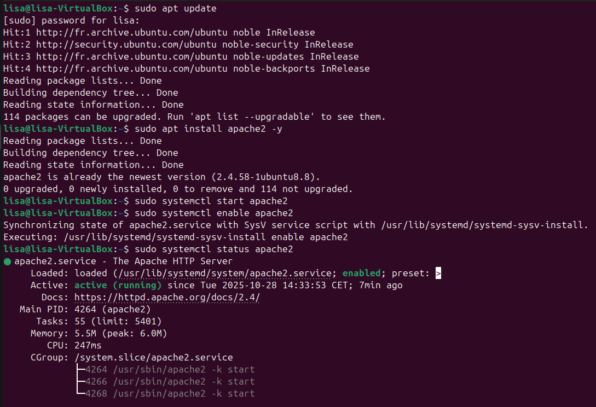

### b. Configurer le serveur pour servir une page web simple.

Je me dirige dans le dossier par défaut et supprime la page html par défaut.
```
cd /var/www/html
sudo rm index.html
```
Je crée ensuite un nouveau fichier html et copie colle le code donné dans le tp.
```
sudo nano index.html
```
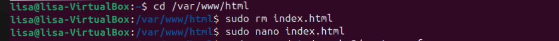

### c. Verifier que le serveur est accessible localement via un navigateur.

Je vérifie ensuite ma page en ouvrant mon navigateur et visite le site: http://localhost


### d. Modifier la configuration pour que le serveur réponde sur un port non standard (ex:8080).

Je modifie le fichier de configuration de la page et remplace la ligne "Listen 80" par " Listen 8080".
```
sudo nano /etc/apache2/ports.conf
```
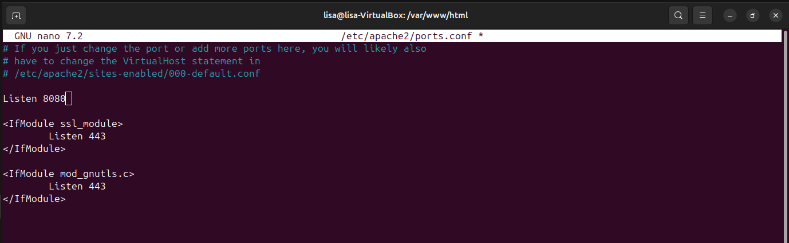

Ensuite je modifie le Virtual Host et je change "<VirtualHost *: 80> par "<VirtualHost *: 8080>.

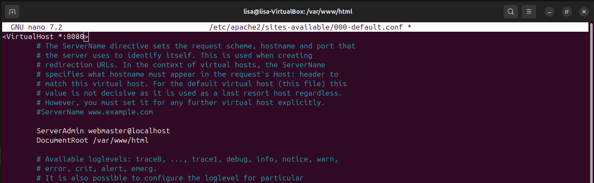

Je redémarre Apache. 
```
sudo systemctl restart apache2
```
Et teste avec la nouvelle adresse sur mon navigateur: http://localhost:8080

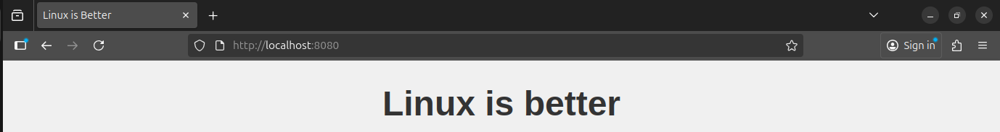

## 2. Configuration du pare-feu avec UFW

### a. Configurer un pare-feu pour n'autoriser que les connexions sur le port du serveur web (ex: 8080) et SSH (port 22).

 J'installe UFW.
 ```
 sudo apt install ufw -y
 ```
 J'autorise les connexions sur le port SSH (port 22) et du serveur web (port 8080).

 ```
 sudo ufw allow 22 
 sudo ufw allow 8080
 ```

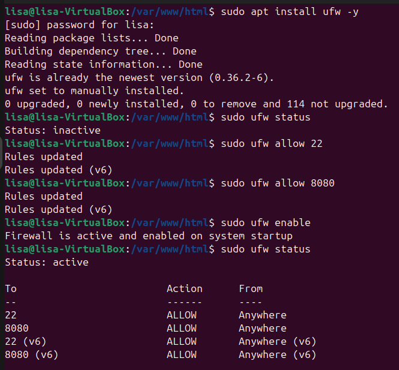

 ### b. Bloquer toutes les autres connexions entrantes
 Avec cette commande :
 ```
 sudo ufw default deny incoming
 ```
 Enfin j'active le pare-feu (je l'ai fait dans la photo précédente, avant de bloquer les autres connexions)
 ```
 sudo ufw enable
 ```
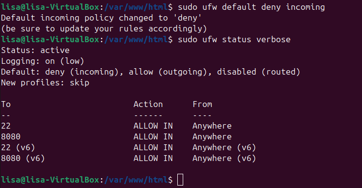

### c. Tester les règles en essayant de se connecter via d'autres ports

J'utilise la commande nc (netcat) pour vérifier différents ports:
```
nc -zv localhost 8080
```
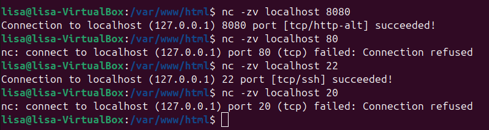

## 3. Sécurisation des connecxions SSH

### a. Configuer votre vm pour accepter que les connexions via clefs ssh

Je commence par générer une clé SSH sur Windows dans PowerShell.
```
ssh-keygen
```
Je trouve l'emplacement de ma clé publique. Dans ma VM, je crée un dossier .shh puis un fichier pour pouvoir mettre ma clé dedans:
```
mkdir -p ~/.ssh
nano ~/.ssh/authorized_keys
```
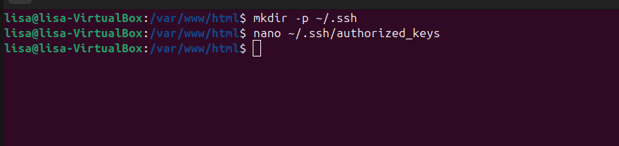


Il faut ensuite interdire les connexions par mot de passe, puisqu'on veux accepter que les connexions via clefs ssh. 
J'ouvre le fichier de configuration, et je vérifie que c'est 2 lignes y soient (je change yes/no si nécessaire):
```
PasswordAuthentication no
PubkeyAuthentication yes
```
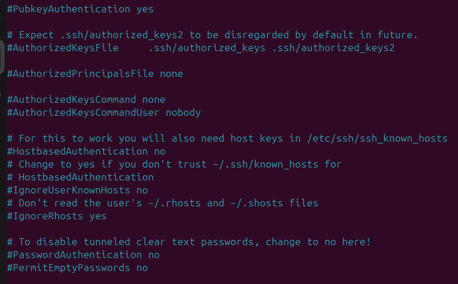

Après avoir sauvegardé je redémarre le service pour appliquer les modifications:
```
sudo systemctl restart ssh
```
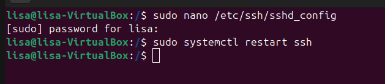

 ### b. Désactiver le login de l'utilisateur root sur ssh

 Dans le même fichier, je cherche la ligne:
 ```
 PermitRootLogin prohibit-password
 ```
 Et je la change en:
 ```
 PermitRootLogin no
 ```
 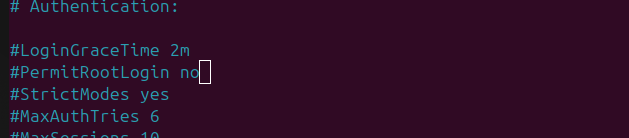
 
 Je fais ensuite un restart:
 ```
 sudo systemctl restart ssh
 ```
