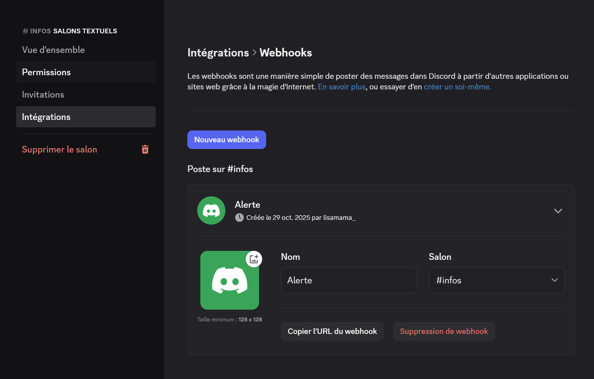
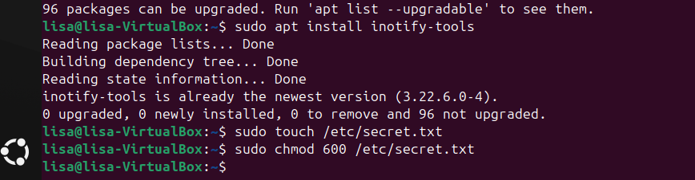
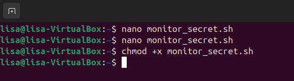
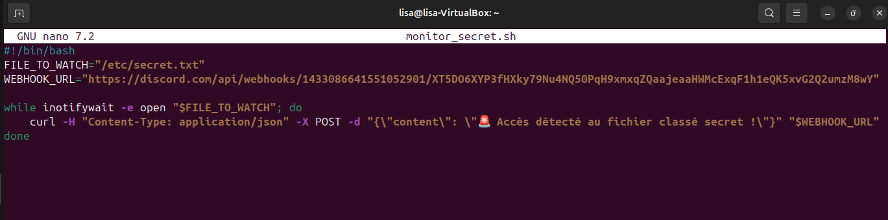
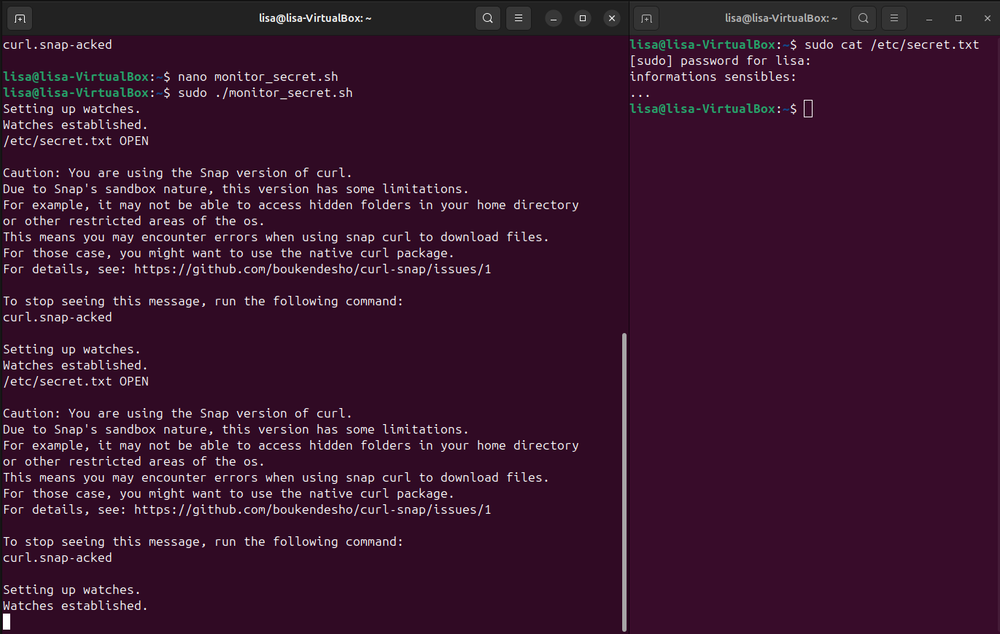
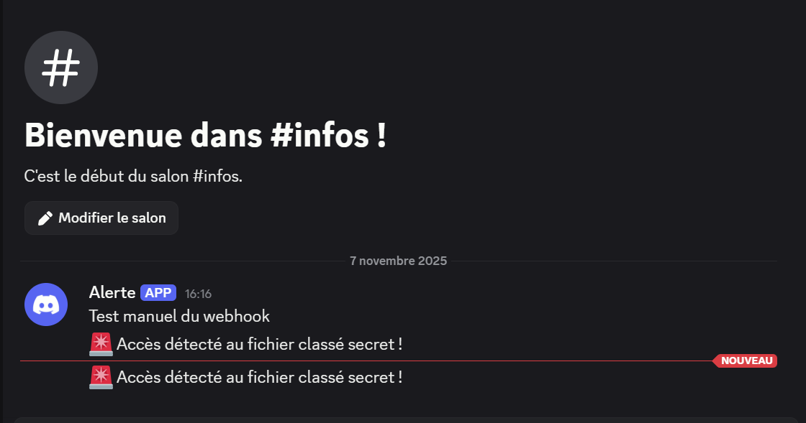
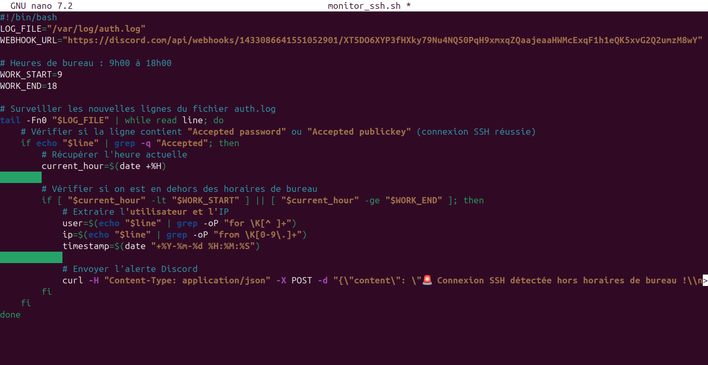
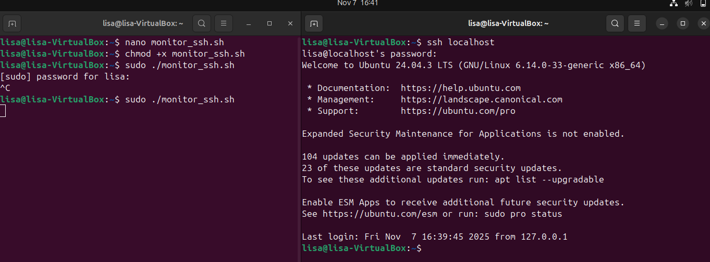
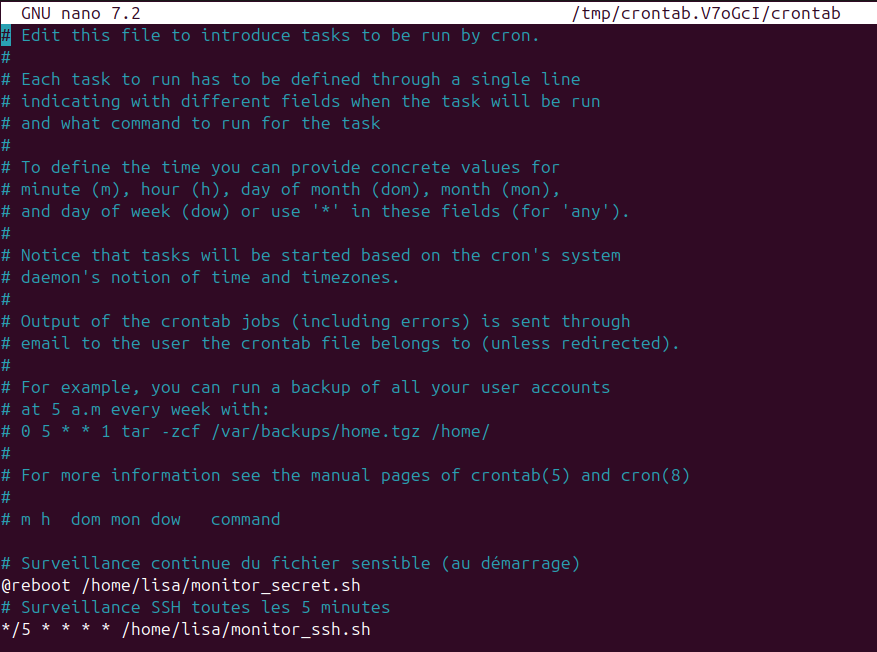
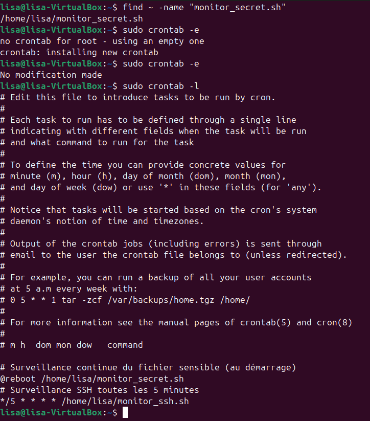

# TP 2

## 1. Préparation et configuration du webhook
<u>Question</u> : Créer un webhook sur un serveur Discord aux alertes de sécurités.
<u>Question</u> : Récupérer l’URL du webhook pour l’utiliser dans les scripts d’alerte.



## 2. Surveillance des accès à des fichiers sensibles

J'installe inotify-tools.
```
sudo apt update
sudo apt install inotify-tools
```
je crée le dossier à surveiller et met l'écriture et la lecture uniquement pour moi.
```
sudo touch /etc/secret.txt
sudo chmo 600 /etc/secret.txt
```



Je crée un nouveau fichier pour mon script puis je le rend éxecutable.
```
nano monitor_secret.sh
chmod +x monitor_secret.sh
```



Enfin je teste la détection:
- Je lance le script de surveillance
```
sudo ./monitor_secret.sh
```
- Sur un autre terminal j'ouvre le fichier secret
```
sudo cat /etc/secret/txt
```

Résultat attendu:
 - Un message sur le serveur discord pour avertir que le fichier à été ouvert





## 3. Surveillance des connexions SSH hors des horaires de bureau

Je commence par créer le script de suveillance SSH
``` 
nano monitor_ssh.sh
```
Et je copie colle le script pour surveiller les connexions SSH en dehors de 9h00-18H00.



Je rend le script éxecutable et le teste.
```
chmod +x monitor_ssh.sh
sudo ./monitor_ssh.sh
```
Enfin, j'ouvre un autre temrinal et je simule une connexion SSH locale.
```
ssh localhost
```
Si je suis en dehors de 9H-18h, je reçoit une alerte Discord, sinon rien ne se passe.



## 4. Automatisation avec cron pour une surveillance continue

J'ouvre *cron*. Et je modifie en ajoutant ces 2 lignes:
```
# Surveillance continue du fichier sensible (au démarrage)
@reboot /home/lisa/monitor_secret.sh

# Surveillance SSH toutes les 5 minutes
*/5 * * * * /home/lisa/monitor_ssh.sh
```

Puis je vérifie que c'est bien configuré.
```
sudo crontab -l
```


